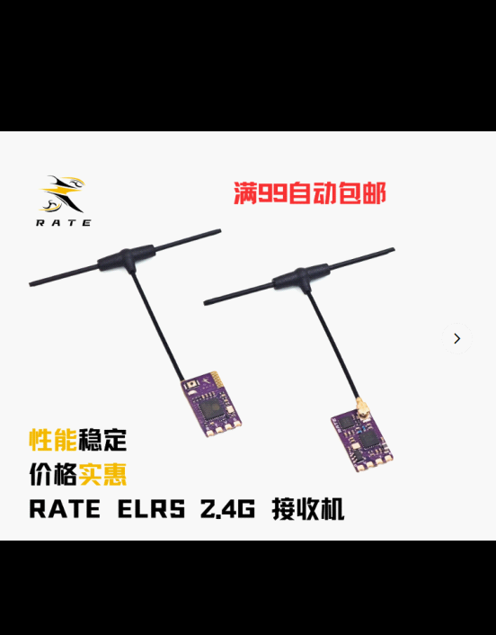

1、整体重量控制在500g以内
2、可延伸的长度尽可能长（角度考虑，适当有角度倾斜的设计）
3、现阶段不考虑前爪可拆卸，把它当成整体
4、悬挂测试，用805的加速度计来测量加速度
5、控制算法的优化，可以量化负载（5g 10g...）
6、远程遥控，考虑用穿越机的接收机

7、地面端控制
一个信号灯： 常亮是开机模式，慢闪是自动模式开启
两个按键: 
A有两个功能，电源开关（常按2s确定），自动/手动模式切换（短按确定）
B 长按2s伸出前臂，短按是开关夹爪（仅手动模式）