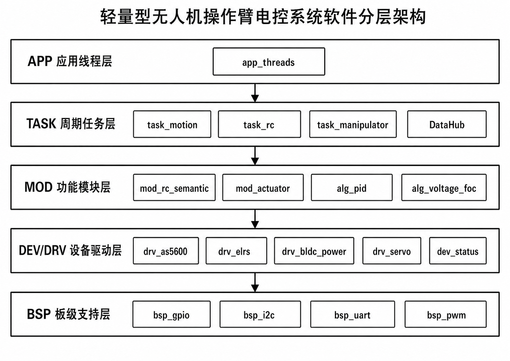
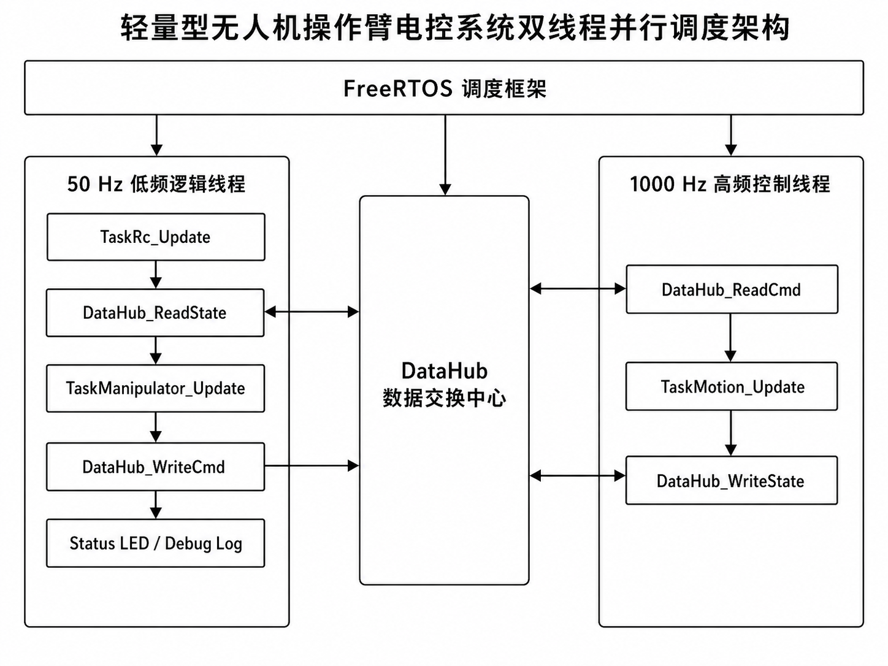
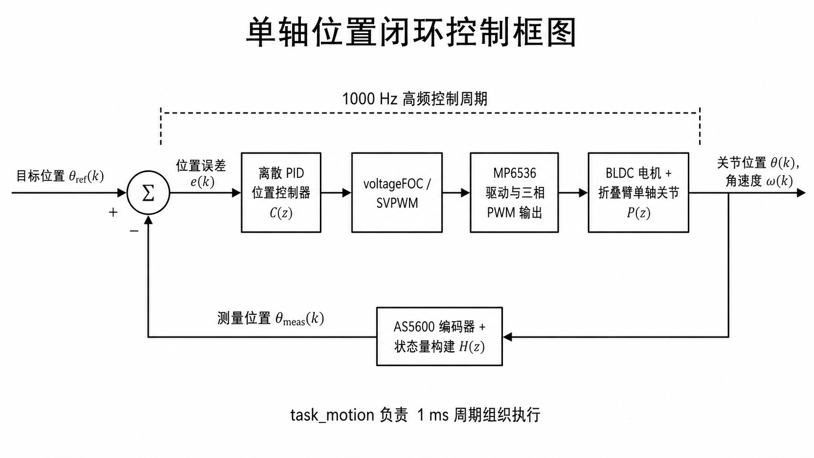

# AerialRoboArm

**一套基于 STM32F103、FreeRTOS、BLDC 位置闭环控制、AS5600 反馈与 ELRS 遥控输入的轻量型无人机折叠操作臂电控系统样机。**

[English version](./README.md)

## TL;DR

AerialRoboArm 是一个经过实机验证的嵌入式机器人电控项目，面向轻量型无人机挂载折叠操作臂场景，完成了从 STM32 外设抽象、FreeRTOS 调度、BLDC 闭环控制、ELRS 遥控输入到板载串口 testbench 验证的完整电控链路。

- 最终仓库分支：**`main = demo_v6`**。
- 运行时结构：**1 kHz 高频电机控制线程 + 50 Hz 低频逻辑 / testbench 线程**。
- 控制链路：**AS5600 位置反馈 + 定点 PID + 电压 FOC + SVPWM 输出**。
- 遥控输入：支持 **ELRS MANUAL 模式**，可将遥控输入映射为闭环电机目标值。
- 调试接口：基于 **115200 8N1 串口 testbench**，支持电机对齐、开环测试、闭环测试、RC 控制、AUTO 阶跃测试与遥测观测。
- 资源占用：在 STM32F103C8T6 上，**RAM 使用 20,104 B / 20 KB = 98.16%**，**FLASH 使用 65,412 B / 64 KB = 99.81%**。
- 实机验证：样机已完成折叠臂闭环运动与保持演示；在当前 12 V 原型供电和机械重力负载条件下，45° 目标指令可稳定保持在约 30° 的力矩平衡位置，反映出当前硬件配置下的电机转矩裕量限制。

<p align="center">
  
</p>

<p align="center">
  
  
</p>

## 概览

AerialRoboArm 是本人本科毕业设计项目对应的定稿固件与文档仓库，项目目标是实现一套面向轻量型无人机挂载折叠操作臂的电控子系统。

项目重点不是构建通用机器人框架，而是在 STM32F103 资源受限平台上完成可运行、可观测、可实机验证的控制系统。系统集成了 STM32 外设抽象、FreeRTOS 双频调度、BLDC 电机控制、AS5600 位置反馈、ELRS 遥控语义映射，以及用于分阶段硬件验证的板载串口 testbench。

当前 `demo_v6` 固件为最终演示版本，仓库按照作品集工程案例进行整理，包含源码、架构图、实机演示材料与设计文档。该项目不是通用机器人框架，而是一个围绕电控子系统展开的嵌入式工程样机。

## 关键结果

| 项目 | 结果 |
| --- | --- |
| 最终分支 | `main = demo_v6` |
| 主控平台 | STM32F103C8T6，72 MHz，20 KB RAM，64 KB FLASH |
| 运行结构 | FreeRTOS 双频调度 |
| 高频线程 | 1 kHz 电机反馈、PID、FOC、PWM 更新 |
| 低频线程 | 50 Hz 控制台、RC 处理、demo 逻辑、遥测输出 |
| 串口 testbench | 115200 8N1 |
| 资源占用 | RAM 20,104 B / 20 KB = 98.16%；FLASH 65,412 B / 64 KB = 99.81% |
| 闭环实机演示 | 45° 指令下，当前样机可在约 30° 位置形成稳定力矩平衡 |
| 主要限制 | 当前 12 V 原型供电与机械负载条件下，电机转矩裕量不足以支撑完整 45° 目标位保持 |

## 演示媒体

以下媒体文件用于展示最终样机与验证流程。

| 素材 | 说明 |
| --- | --- |
| [整机系统全览图](./Figures/DEMO/整机系统全览图.jpg) | 集成样机的实物整体视图。 |
| [电控系统原型控制平台](./Figures/DEMO/电控系统原型控制平台.jpg) | STM32 电控平台与接线环境。 |
| [编码器与关节电机安装实物图](./Figures/DEMO/编码器与关节电机安装实物图.jpg) | AS5600 编码器与 BLDC 关节电机安装方式。 |

**实机闭环折叠臂演示**


**基于 ELRS 遥控器的手动闭环控制演示**


## 最终演示范围

当前 `demo_v6` 固件是定稿的板载 testbench/demo 版本。它验证了 GIF 演示中呈现的电控主链路：

- BLDC 电机电角对齐。
- 电机开环电压矢量测试。
- 1 kHz 单轴闭环位置控制。
- AS5600 编码器反馈与连续 `ext_raw` 位置跟踪。
- BLDC 电压 FOC / SVPWM 输出与功率级驱动。
- ELRS 遥控输入解析与语义映射。
- 从 RC 输入到电机目标值的 MANUAL 控制桥接。
- 用于分阶段闭环响应记录的 AUTO 阶跃测试。
- 串口控制台菜单、状态快照日志与紧凑遥测输出。

`Core/Src/main.c` 中的当前固件入口调用 `App_Testbench_Init()`，用于挂载双线程 demo/testbench 运行时。

在当前样机负载条件下，45° 目标指令最终稳定在约 30° 位置，主要原因是电机输出转矩与机械臂重力矩达到平衡。该结果验证了闭环控制链路能够工作，同时也暴露出当前电机与供电配置下的转矩裕量不足问题。

## 系统架构

固件被组织为分层嵌入式系统，而不是散装 demo 程序。该设计将芯片级硬件访问、设备驱动、可复用控制模块、任务级 runnable 与应用/testbench 容器分离。

### 软件分层

<p align="center">
  
</p>

| 层级 | 职责 | 主要目录 |
| --- | --- | --- |
| L5 Application | 物理线程容器与 demo/testbench 编排 | `User/app` |
| L4 Task | Motion、RC 与 manipulator runnable | `User/task` |
| L3 Module / Algorithm | PID、电压 FOC、执行器抽象、RC 语义 | `User/mod` |
| L2 Driver | 设备级硬件驱动 | `User/drv` |
| L1 BSP | STM32 外设抽象 | `User/bsp` |

### 双线程运行时调度

最终 demo 运行时采用双频 FreeRTOS 结构。1 kHz 高频控制线程负责电机反馈、控制计算、FOC 输出与 PWM 更新；50 Hz 低频逻辑线程负责控制台输入、RC 处理、demo 状态转移、日志输出与 testbench 编排。

`DataHub` 用于解耦两个时序域之间的命令与状态交换。

<p align="center">
  
</p>

### 单轴位置闭环控制

折叠臂主轴被组织为一条位置闭环控制链路：目标位置、定点离散 PID、电压 FOC / SVPWM 输出、三相功率级驱动、BLDC 关节运动，以及 AS5600 位置反馈。

<p align="center">
  
</p>

## 硬件平台

样机基于资源受限的 STM32F103 控制平台构建。硬件选型强调低成本、轻量化，以及与无人机挂载机械臂场景的直接相关性。

| 组件 | 作用 |
| --- | --- |
| STM32F103C8T6 | 嵌入式主控 |
| FreeRTOS | 双频运行时调度 |
| BLDC 云台电机 | 折叠臂关节执行器 |
| SimpleFOCMini / BLDC 功率级 | 三相电机驱动接口 |
| AS5600 磁编码器 | 基于 I2C 的关节位置反馈 |
| ELRS 接收机 | 低延迟遥控输入 |
| 舵机输出 | 低频夹爪 / 辅助执行器输出 |
| 定制 / 原型电控平台 | 电气集成与分阶段调试 |

## 编译与运行

本仓库保留为 `demo_v6` 固件的最终工程快照。推荐的阅读与上机路径如下：

1. 打开 STM32CubeMX 生成的工程。
2. 使用兼容 STM32F1 的 ARM GCC / STM32CubeIDE / CMake 嵌入式工具链进行编译。
3. 通过 ST-Link / SWD 将固件烧录到 STM32F103C8T6 目标板。
4. 使用 **115200 8N1** 串口终端连接调试口。
5. 通过板载 testbench 菜单进行分阶段验证。

主要运行入口如下：

| 文件 / 模块 | 作用 |
| --- | --- |
| `Core/Src/main.c` | 固件入口与应用初始化 |
| `User/app/app_threads.*` | FreeRTOS 线程创建与运行时挂载 |
| `User/app/app_testbench.*` | 串口 testbench 与 demo 编排 |
| `User/task/task_motion.*` | 1 kHz 单轴运动控制 runnable |
| `User/task/task_rc.*` | ELRS 输入处理 |
| `User/mod/alg_pid.*` | 定点 PID 控制器 |
| `User/mod/alg_voltage_foc.*` | 电压 FOC 控制算法 |
| `User/drv/drv_as5600.*` | AS5600 编码器驱动 |
| `User/drv/drv_elrs.*` | ELRS 接收机驱动 |

## 仓库结构

```text
Core/          STM32CubeMX 生成的核心源码、中断与系统文件
Drivers/       STM32 HAL 与 CMSIS 依赖
Middlewares/   FreeRTOS 中间件
User/app/      应用层与 demo/testbench 线程容器
User/task/     motion、RC 与 manipulator 任务级 runnable
User/mod/      PID、FOC、RC 语义等算法与功能模块
User/drv/      AS5600、BLDC 功率级、ELRS、舵机与状态 IO 设备驱动
User/bsp/      UART、I2C、PWM、GPIO 等 MCU 外设抽象
Doc/           整理后的文档、个人贡献说明、演示说明与归档资料
Figures/       README 与最终 demo 媒体素材
```

## 我的工作

我负责项目中的嵌入式电控系统部分，主要工作包括：

* STM32F103 固件架构设计与 FreeRTOS 任务组织。
* UART、I2C、PWM、AS5600 反馈、ELRS 输入、BLDC 功率级输出与舵机输出相关的 BSP / Driver 集成。
* 面向折叠臂 BLDC 主轴的定点 PID 与电压 FOC 控制链路。
* 基于 AS5600 的跨圈安全 `ext_raw` 连续位置表达，用于闭环位置控制。
* ELRS 遥控通道解析，以及面向手动控制、模式控制和安全行为的语义映射。
* 串口 testbench 设计，支持电机对齐、开环测试、闭环测试、RC 手动控制、AUTO 阶跃测试与遥测观测。
* 与本科毕业设计定稿范围一致的仓库文档整理。

更详细的个人工作说明见 [Doc/MY_WORK.md](./Doc/MY_WORK.md)。

## 开发工作流

本项目采用一套 AI 辅助的契约驱动嵌入式开发流程：**DACMAS**，即 **Designer - APIer - Coder Multi-Agent System**。

该流程的核心思路是将系统级设计、接口契约与局部代码实现拆分为不同的 AI 辅助角色，同时由人类开发者保持对系统架构、模块集成、硬件验证和最终工程决策的控制。

* **Designer**：维护全局架构、系统行为、状态机意图以及 L1-L5 分层边界。
* **APIer**：将设计简报转化为明确的 C 语言契约，尤其是 `.h` 头文件、数据结构、函数签名与接口约束。
* **Coder**：在接口契约限制下实现局部 `.c` 文件，关注嵌入式 C 细节、错误处理、栈安全、时序约束与硬件行为。

我的角色是定义系统目标、维护事实源、约束智能体、审查生成代码、集成模块、编译烧录固件、观察真实硬件故障，并将基于硬件现象的反馈送回到正确的开发角色中继续迭代。

因此，这个项目更接近一个 AI-native 硬件工程工作流，而不是简单的代码生成练习。最终固件仍然以编译、烧录、串口观测和物理样机验证为准。

完整方法论见 [About AI Assist Pipeline - Share.md](./Doc/About%20AI%20Assist%20Pipeline%20-%20Share.md)。

## 文档入口

有用的文档入口：

* [文档索引](./Doc/README.md)
* [个人工作与贡献边界](./Doc/MY_WORK.md)
* [最终演示说明](./Doc/demo/final-demo.md)
* [系统顶层设计约束](./Doc/design/00_SYSTEM_CONSTITUTION.md)
* [运行时架构](./Doc/design/01_RUNTIME_ARCHITECTURE.md)
* [引脚表](./Doc/hardware/pinmap.md)

历史记录和早期草案保留在 `Doc/archive/` 下，用于追溯项目演进。README 表示经过整理后的作品集级项目视图。

## 边界与限制

本仓库展示的是本科阶段工程样机，而不是产品级无人机系统。项目重点是机械臂电控子系统与最终 demo/testbench 固件。

当前限制包括：

* 当前电机 / 供电 / 机械配置下的转矩裕量不足，无法在当前重力负载条件下完整保持 45° 目标位置。
* RAM 与 FLASH 使用率已经接近 STM32F103C8T6 的容量上限，后续继续扩展功能需要进一步优化或迁移平台。
* 当前 demo 固件验证了电控主链路，但并未实现完整的自主空中操作流程。

本仓库不覆盖以下内容：

* 无人机飞控、姿态控制或导航闭环。
* 产品级故障恢复与安全认证。
* 完整自主感知、规划与端到端空中抓取。
* 毕业论文正文。

## 致谢

本项目基于 STM32 生态以及若干重要开源 / 厂商组件完成：

* [FreeRTOS](https://www.freertos.org/) 用于实时调度。
* STMicroelectronics HAL 与 CMSIS 包用于 STM32F1 支持。
* [SimpleFOC](https://simplefoc.com/) 及其社区资料作为 BLDC / FOC 学习参考。
* DengFOC 与相关社区教程在早期电机控制调试中提供了帮助。

```
```
