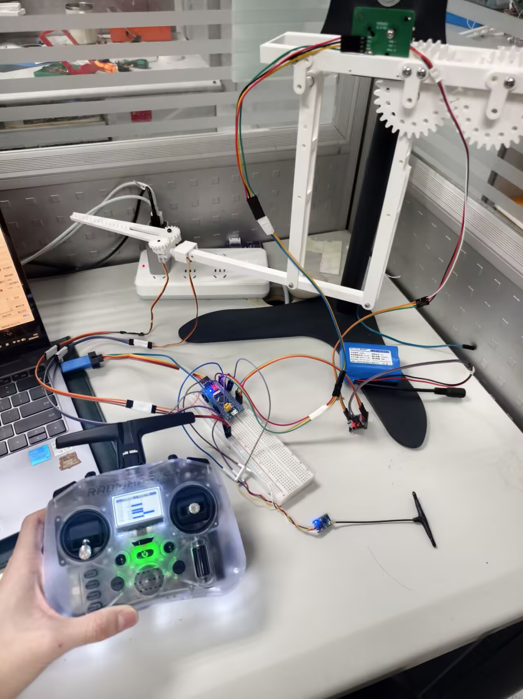
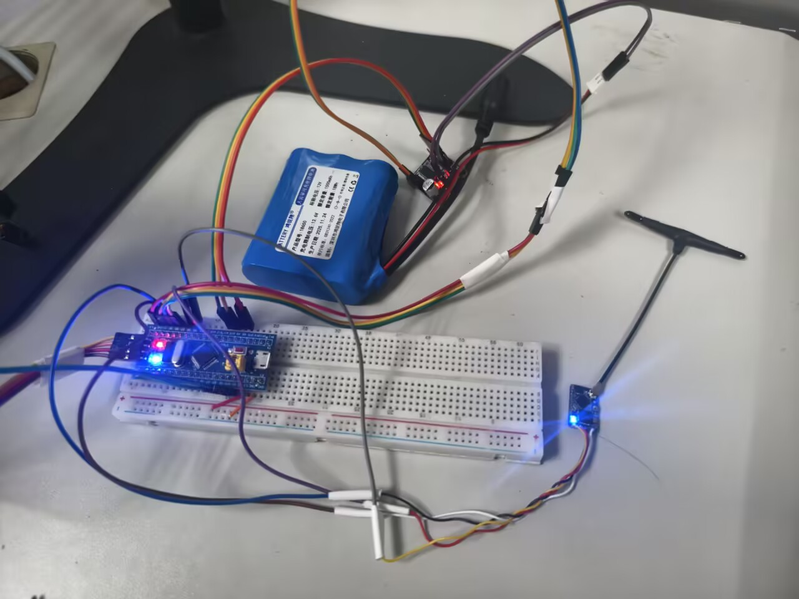
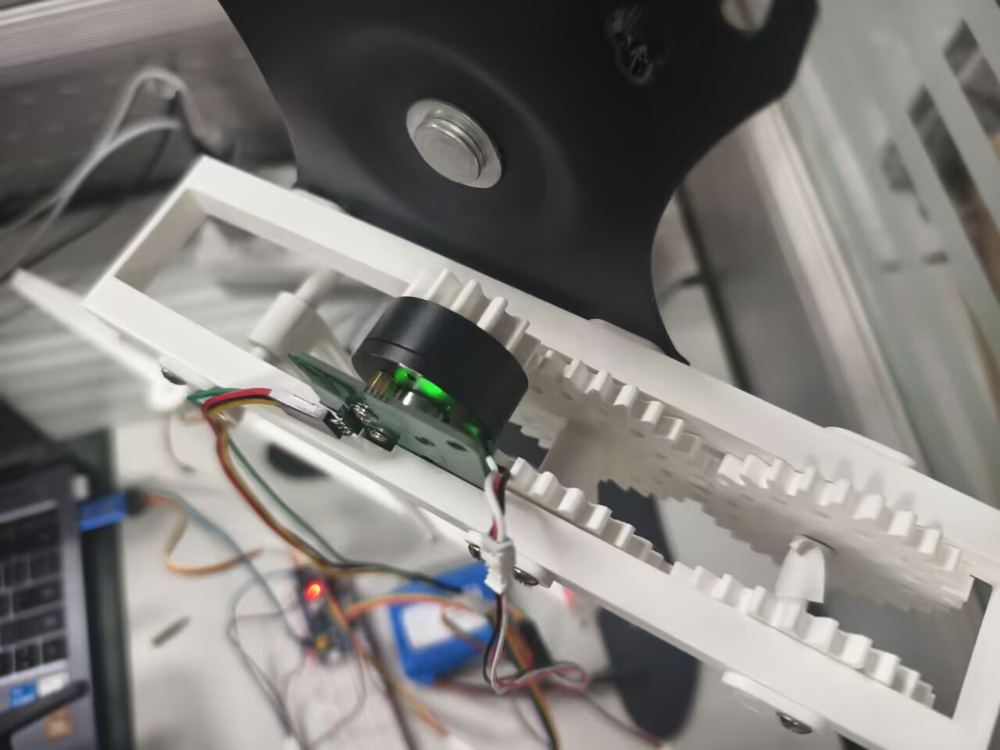
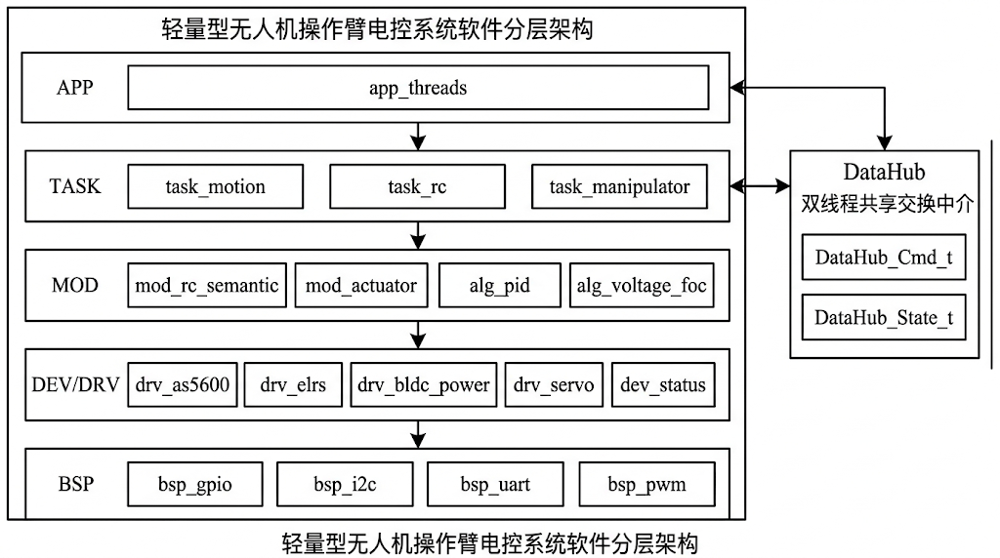
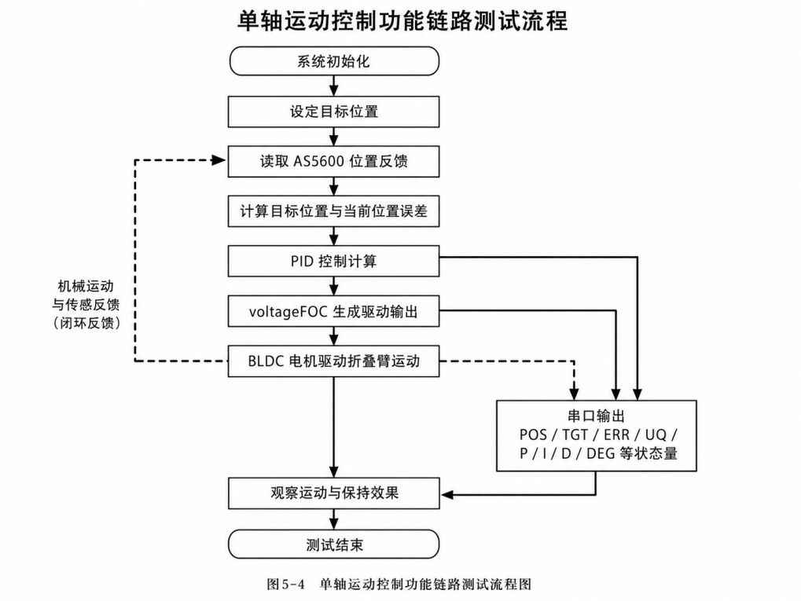

# AerialRoboArm

**A lightweight UAV-mounted robotic arm electrical-control prototype based on STM32F103, FreeRTOS, BLDC motor control, AS5600 feedback, and ELRS remote input.**

[中文版本](./README-zh.md)

This repository presents the finalized engineering implementation of my undergraduate thesis project. The thesis document itself is not included here; this repository focuses on the firmware, electrical-control architecture, hardware context, and final demo materials behind the project.

<p align="center">
  
</p>

<p align="center">
  
  
</p>

## Overview

AerialRoboArm is an embedded electrical-control prototype for a lightweight foldable robotic arm intended for UAV-mounted operation. The project explores how to build a compact control subsystem under tight MCU resource constraints while still supporting motor control, remote operation, staged validation, and practical engineering observability.

The finalized `demo_v6` version is organized as an engineering case study rather than a general-purpose robotics framework. Its main value is the complete control chain: STM32F103 peripheral abstraction, FreeRTOS task organization, BLDC motor control, AS5600 position feedback, ELRS remote-control semantics, and an on-board serial testbench for final demonstration.

## One more thing

This project would not have been possible without my AI-native development workflow: **DACMAS** -- the **Designer - APIer - Coder Multi-Agent System**.

In practice, I wrote only a relatively small portion of the final C code directly by hand. The project was developed through a human-in-the-loop AI assist pipeline where I acted as the system owner, context router, contract reviewer, and physical validator. DACMAS separated the work into three AI-assisted roles:

- **Designer**: maintained the global architecture, system behavior, state-machine intent, and L1-L5 design boundaries.
- **APIer**: converted design briefs into explicit C contracts, especially `.h` files, data structures, function signatures, and interface constraints.
- **Coder**: implemented local `.c` files within the contracts, focusing on embedded C details, error handling, stack safety, timing constraints, and hardware-facing behavior.

This made the project an **AI-native hardware project**, rather than merely AI-assisted: the core workflow was contract-driven, context-isolated, and validated through real hardware bring-up. My main engineering work was **ALMOST ONLY** to define the architecture, constrain the agents, preserve the source of truth in the repository, review generated code, compile and flash on hardware, observe failures, and feed the right kind of feedback back into the right role.

For the full methodology, see [About AI Assist Pipeline - Share.md](./Doc/About%20AI%20Assist%20Pipeline%20-%20Share.md).

## My Work

I was responsible for the embedded electrical-control side of the project. My work included:

- STM32F103 firmware architecture and FreeRTOS task organization.
- BSP and driver integration for UART, I2C, PWM, AS5600 feedback, ELRS input, BLDC power-stage output, and servo output.
- Fixed-point PID and voltage-FOC control pipeline for the BLDC folding-arm axis.
- Wrap-safe `ext_raw` position representation for AS5600-based closed-loop control.
- ELRS remote-control channel parsing and semantic mapping for manual operation, mode control, and safety behavior.
- Serial testbench design for motor alignment, open-loop test, closed-loop test, RC manual control, AUTO step test, and telemetry observation.
- Repository documentation aligned with the finalized undergraduate project scope.

For a more detailed contribution breakdown, see [Doc/MY_WORK.md](./Doc/MY_WORK.md).

## What This Repository Contains

This repository contains the finalized firmware source, curated design notes, hardware-context figures, and demo media for the AerialRoboArm electrical-control subsystem. It does not contain the thesis document itself.

Key materials include:

- STM32CubeMX-generated project configuration and STM32F103 firmware source.
- Layered user firmware under `User/`, including BSP, drivers, algorithms/modules, tasks, and application/testbench code.
- HAL, CMSIS, and FreeRTOS dependencies required by the firmware project.
- Hardware and system figures under `Figures/`.
- Curated design, hardware, demo, and archive documents under `Doc/`.

## Demo Media

The following media files are used as the repository's visual evidence of the final prototype and validation workflow.

| Material | Description |
| --- | --- |
| [Full system overview](./Figures/DEMO/整机系统全览图.jpg) | Physical view of the integrated prototype. |
| [Electrical-control prototype platform](./Figures/DEMO/电控系统原型控制平台.jpg) | STM32-based control platform and wiring context. |
| [Encoder and joint motor installation](./Figures/DEMO/编码器与关节电机安装实物图.jpg) | AS5600 encoder and BLDC joint installation. |
| [Closed-loop folding-arm demo video](./Figures/DEMO/实机闭环控制折叠臂模拟动作演示.mp4) | Physical closed-loop motion demonstration. |
| [ELRS manual closed-loop control demo video](./Figures/DEMO/基于%20ELRS%20遥控器的手动闭环控制演示.mp4) | Manual closed-loop operation through ELRS remote input. |

## Final Demo Scope

The current `demo_v6` firmware is a finalized on-board testbench/demo version. It validates the electrical-control chain used by the project:

- BLDC motor electrical alignment.
- Motor open-loop voltage-vector test.
- Motor closed-loop position-control test.
- AS5600 encoder feedback and continuous `ext_raw` position tracking.
- ELRS remote-input decoding and semantic mapping.
- MANUAL bridge from RC input to motor target.
- AUTO step test for staged closed-loop response recording.
- Serial console menu, snapshot logs, and compact telemetry output.

The active firmware entry in `Core/Src/main.c` calls `App_Testbench_Init()`, which mounts the dual-thread demo/testbench runtime.

## System Architecture

The firmware is organized as a layered embedded system. The design separates chip-level hardware access, device drivers, reusable modules, task-level runnables, and the application/testbench container.

<p align="center">
  
</p>

| Layer | Responsibility | Main Directory |
| --- | --- | --- |
| L5 Application | Physical thread containers and demo/testbench orchestration | `User/app` |
| L4 Task | Motion, RC, and manipulator runnables | `User/task` |
| L3 Module / Algorithm | PID, voltage FOC, actuator abstraction, RC semantics | `User/mod` |
| L2 Driver | Device-level hardware drivers | `User/drv` |
| L1 BSP | STM32 peripheral abstraction | `User/bsp` |

The final demo runtime follows a dual-rate structure:

- A 1 kHz high-frequency control thread for motor feedback, control computation, FOC output, and PWM update.
- A 50 Hz low-frequency logic thread for console input, RC processing, demo state transitions, logging, and testbench orchestration.

<p align="center">
  
</p>

## Hardware Platform

The prototype is built around a resource-constrained STM32F103 control platform. The hardware choices emphasize low cost, low weight, and direct relevance to the UAV-mounted robotic-arm scenario.

| Component | Role |
| --- | --- |
| STM32F103C8T6 | Main embedded controller. |
| FreeRTOS | Dual-rate runtime scheduling. |
| BLDC gimbal motor | Folding-arm joint actuator. |
| SimpleFOCMini / BLDC power stage | Three-phase motor drive interface. |
| AS5600 magnetic encoder | Joint position feedback over I2C. |
| ELRS receiver | Low-latency remote-control input. |
| Servo outputs | Low-frequency gripper / auxiliary actuator outputs. |
| Custom / prototype control platform | Electrical integration and staged bring-up. |

## Repository Structure

```text
Core/          STM32CubeMX-generated core source and interrupt/system files
Drivers/       STM32 HAL and CMSIS dependencies
Middlewares/   FreeRTOS middleware
User/app/      Application and demo/testbench thread containers
User/task/     Task-level runnables for motion, RC, and manipulator logic
User/mod/      Algorithms and functional modules such as PID, FOC, and RC semantics
User/drv/      Device drivers for AS5600, BLDC power stage, ELRS, servo, and status IO
User/bsp/      MCU peripheral abstraction for UART, I2C, PWM, and GPIO
Doc/           Curated documentation, contribution summary, demo notes, and archive
Figures/       README and final demo media
```

## Documentation

Useful documentation entry points:

- [Documentation index](./Doc/README.md)
- [My work and contribution boundary](./Doc/MY_WORK.md)
- [Final demo notes](./Doc/demo/final-demo.md)
- [System constitution](./Doc/design/00_SYSTEM_CONSTITUTION.md)
- [Runtime architecture](./Doc/design/01_RUNTIME_ARCHITECTURE.md)
- [Pin map](./Doc/hardware/pinmap.md)

Historical notes and early drafts are kept under `Doc/archive/` for traceability. The README represents the curated portfolio-level project view.

## Limitations

This repository presents an undergraduate engineering prototype, not a product-grade UAV system. The project focuses on the robotic-arm electrical-control subsystem and final demo/testbench firmware.

Out of scope for this repository:

- UAV flight-control, attitude-control, or navigation closed loop.
- Product-grade fault recovery and safety certification.
- Full autonomous perception, planning, and end-to-end aerial grasping.
- The final thesis document itself.

## Credits

This project builds on the STM32 ecosystem and several important open-source / vendor-provided components:

- [FreeRTOS](https://www.freertos.org/) for real-time scheduling.
- STMicroelectronics HAL and CMSIS packages for STM32F1 support.
- [SimpleFOC](https://simplefoc.com/) and related community materials as references for BLDC / FOC learning.
- DengFOC and community tutorials as helpful references during early motor-control bring-up.
