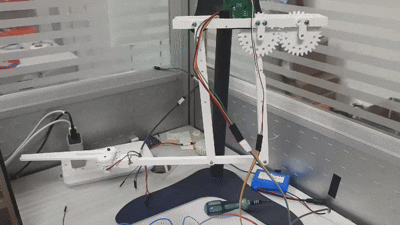
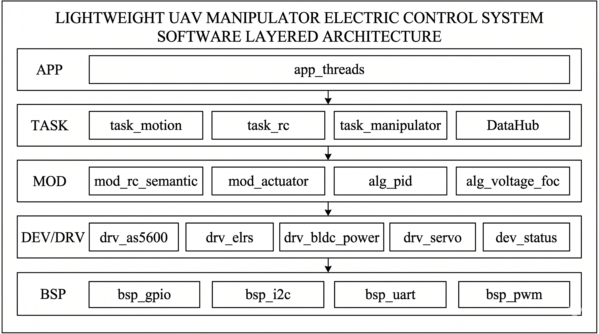
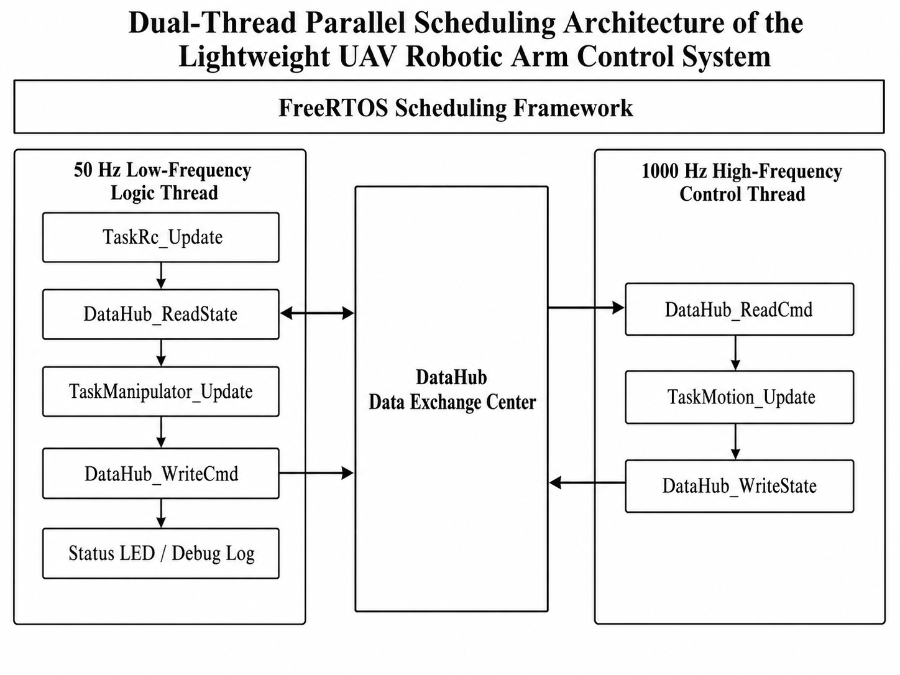
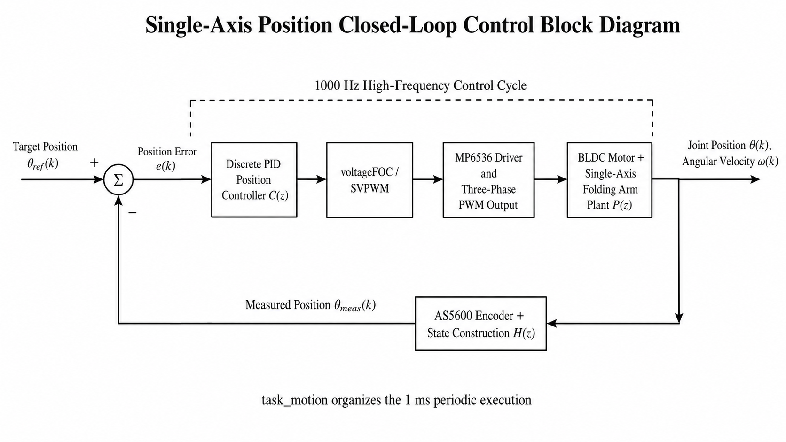

<div align="center">

# AerialRoboArm

**A real-hardware embedded robotics control prototype for a lightweight UAV-mounted folding arm, built on STM32F103, FreeRTOS, BLDC closed-loop control, AS5600 feedback, and ELRS remote input**

[中文](./README-zh.md)

<br>


</div>

---

## Quick Navigation

- [TL;DR](#tldr)
- [Project Snapshot](#project-snapshot)
- [Hardware Demo](#hardware-demo)
- [System Architecture](#system-architecture)
- [Hardware Platform](#hardware-platform)
- [Build and Run](#build-and-run)
- [Repository Structure](#repository-structure)
- [My Work](#my-work)
- [Development Workflow](#development-workflow)
- [Documentation](#documentation)
- [Limitations](#limitations)
- [Credits](#credits)

---

## TL;DR

> AerialRoboArm is a real-hardware embedded robotics project for a lightweight UAV-mounted folding arm. It implements a complete electrical-control chain from STM32 peripheral abstraction and FreeRTOS dual-rate scheduling to BLDC closed-loop control, ELRS remote input, and on-board serial testbench validation.

- Final repository branch: **`main = demo_v6`**
- Runtime architecture: **1 kHz high-frequency control loop + 50 Hz low-frequency logic / testbench loop**
- Control chain: **AS5600 position feedback + fixed-point PID + voltage-FOC + SVPWM output**
- Remote input: supports **ELRS MANUAL mode**, mapping RC input into closed-loop motor targets
- Debug interface: **115200 8N1 serial testbench**
- Hardware result: under the current 12 V prototype setup and mechanical gravity load, a **45° command reaches a stable torque-balance position around 30°**
- Resource usage: **RAM 20,104 B / 20 KB = 98.16%**, **FLASH 65,412 B / 64 KB = 99.81%**

---

## Project Snapshot

| Item | Result |
| --- | --- |
| Project scope | Electrical-control prototype for a lightweight UAV-mounted folding arm |
| Final version | `main = demo_v6` |
| MCU platform | STM32F103C8T6, 72 MHz, 20 KB RAM, 64 KB FLASH |
| Runtime | FreeRTOS dual-rate scheduling |
| High-frequency loop | 1 kHz motor feedback, PID, FOC, and PWM update |
| Low-frequency loop | 50 Hz console, RC processing, demo logic, and telemetry |
| Serial debug | 115200 8N1 |
| Closed-loop hardware result | 45° command reaches a stable torque-balance position around 30° |
| Main limitation | The current 12 V prototype setup and mechanical load do not provide enough motor torque margin for full 45° target holding |

---

## Overview

AerialRoboArm is the finalized firmware and documentation repository for my undergraduate thesis project: an electrical-control subsystem for a lightweight UAV-mounted folding arm.

The project does not aim to be a general-purpose robotics framework. Instead, it focuses on building a **runnable, observable, and hardware-validated** control system on the resource-constrained STM32F103 platform. The system integrates STM32 peripheral abstraction, FreeRTOS dual-rate scheduling, BLDC motor control, AS5600 position feedback, ELRS remote-control semantic mapping, and an on-board serial testbench for staged hardware validation.

The current `demo_v6` firmware is the final demonstration version. This repository is organized as a portfolio-level engineering case study, including source code, architecture diagrams, hardware demo media, and curated design documentation.

---

## Hardware Demo

<div align="center">
  
</div>

<br>

<div align="center">
  
  
</div>

### Demo Media

| Material | Description |
| --- | --- |
| [Full system overview](./Figures/DEMO/整机系统全览图.jpg) | Physical view of the integrated prototype |
| [Electrical-control prototype platform](./Figures/DEMO/电控系统原型控制平台.jpg) | STM32-based control platform and wiring context |
| [Encoder and joint motor installation](./Figures/DEMO/编码器与关节电机安装实物图.jpg) | AS5600 encoder and BLDC joint installation |

### Closed-loop Folding-arm Demo



### ELRS Manual Closed-loop Control Demo


---

## Final Demo Scope

The current `demo_v6` firmware is the finalized on-board `testbench/demo` version. It validates the following electrical-control chain:

- BLDC motor electrical alignment
- Motor open-loop voltage-vector test
- 1 kHz single-axis closed-loop position control
- AS5600 encoder feedback and continuous `ext_raw` position tracking
- BLDC voltage-FOC / SVPWM output through the power stage
- ELRS remote-input decoding and semantic mapping
- MANUAL bridge from RC input to the motor target
- AUTO step test for staged closed-loop response recording
- Serial console menu, state snapshot logs, and compact telemetry output

The active firmware entry in `Core/Src/main.c` calls `App_Testbench_Init()`, which mounts the dual-thread `demo/testbench` runtime.

Under the current prototype load, the 45° command settles at approximately 30° because the BLDC output torque reaches equilibrium with the gravitational load. This result validates that the closed-loop control chain works, while also identifying motor torque margin as the main hardware-side limitation of the current motor and power configuration.

---

## System Architecture

The firmware is organized as a layered embedded system rather than a flat demo program. The design separates chip-level hardware access, device drivers, reusable control modules, task-level runnables, and the application / testbench container.

### Software Layering

<div align="center">
  
</div>

| Layer | Responsibility | Main Directory |
| --- | --- | --- |
| L5 Application | Physical thread containers and demo/testbench orchestration | `User/app` |
| L4 Task | Motion, RC, and manipulator runnables | `User/task` |
| L3 Module / Algorithm | PID, voltage FOC, actuator abstraction, RC semantics | `User/mod` |
| L2 Driver | Device-level hardware drivers | `User/drv` |
| L1 BSP | STM32 peripheral abstraction | `User/bsp` |

### Dual-thread Runtime Scheduling

The final demo runtime follows a dual-rate FreeRTOS structure:

- **1 kHz high-frequency control loop**: motor feedback, control computation, FOC output, and PWM update
- **50 Hz low-frequency logic loop**: console input, RC processing, demo state transitions, logging, and testbench orchestration

`DataHub` decouples command/state exchange between the two timing domains.

<div align="center">
  
</div>

### Single-axis Closed-loop Control

The main folding-arm axis is organized as a position-control loop: target position, fixed-point discrete PID, voltage-FOC / SVPWM output, three-phase power-stage drive, BLDC joint motion, and AS5600 position feedback.

<div align="center">
  
</div>

---

## Hardware Platform

The prototype is built around a resource-constrained STM32F103 control platform. The hardware choices emphasize low cost, low weight, and direct relevance to the UAV-mounted robotic-arm scenario.

| Component | Role |
| --- | --- |
| STM32F103C8T6 | Main embedded controller |
| FreeRTOS | Dual-rate runtime scheduling |
| BLDC gimbal motor | Folding-arm joint actuator |
| SimpleFOCMini / BLDC power stage | Three-phase motor drive interface |
| AS5600 magnetic encoder | Joint position feedback over I2C |
| ELRS receiver | Low-latency remote-control input |
| Servo outputs | Low-frequency gripper / auxiliary actuator outputs |
| Custom / prototype control platform | Electrical integration and staged bring-up |

---

## Build and Run

This repository is kept as the final engineering snapshot of the `demo_v6` firmware. The recommended reading and bring-up path is:

1. Open the STM32CubeMX-generated project
2. Build the firmware with an STM32F1-compatible ARM GCC / STM32CubeIDE / CMake-based embedded toolchain
3. Flash the firmware to the STM32F103C8T6 target through ST-Link / SWD
4. Connect a serial terminal using **115200 8N1**
5. Use the on-board testbench menu for staged validation

### Main Runtime Entry Points

| File / Module | Role |
| --- | --- |
| `Core/Src/main.c` | Firmware entry and application initialization |
| `User/app/app_threads.*` | FreeRTOS thread creation and runtime mounting |
| `User/app/app_testbench.*` | Serial testbench and demo orchestration |
| `User/task/task_motion.*` | 1 kHz single-axis motion-control runnable |
| `User/task/task_rc.*` | ELRS input processing |
| `User/mod/alg_pid.*` | Fixed-point PID controller |
| `User/mod/alg_voltage_foc.*` | Voltage-FOC control algorithm |
| `User/drv/drv_as5600.*` | AS5600 encoder driver |
| `User/drv/drv_elrs.*` | ELRS receiver driver |

---

## Repository Structure

```text
Core/          STM32CubeMX-generated core source and interrupt/system files
Drivers/       STM32 HAL and CMSIS dependencies
Middlewares/   FreeRTOS middleware
User/app/      Application and demo/testbench thread containers
User/task/     Task-level runnables for motion, RC, and manipulator logic
User/mod/      Algorithms and functional modules such as PID, FOC, and RC semantics
User/drv/      Device drivers for AS5600, BLDC power stage, ELRS, servo, and status IO
User/bsp/      MCU peripheral abstraction for UART, I2C, PWM, and GPIO
Doc/           Curated documentation, contribution summary, demo notes, and archive
Figures/       README and final demo media
````

---

## My Work

I was responsible for the embedded electrical-control side of the project. My work included:

* STM32F103 firmware architecture and FreeRTOS task organization
* BSP and driver integration for UART, I2C, PWM, AS5600 feedback, ELRS input, BLDC power-stage output, and servo output
* Fixed-point PID and voltage-FOC control pipeline for the BLDC folding-arm axis
* Wrap-safe `ext_raw` position representation for AS5600-based closed-loop control
* ELRS remote-control channel parsing and semantic mapping for manual operation, mode control, and safety behavior
* Serial testbench design for motor alignment, open-loop test, closed-loop test, RC manual control, AUTO step test, and telemetry observation
* Repository documentation aligned with the finalized undergraduate project scope

For a more detailed contribution breakdown, see [Doc/MY_WORK.md](./Doc/MY_WORK.md).

---

## Development Workflow

This project used an AI-assisted, contract-driven embedded development workflow named **DACMAS**: **Designer - APIer - Coder Multi-Agent System**.

The core idea was to separate system-level design, interface contracts, and local implementation into different AI-assisted roles, while keeping human ownership over system architecture, module integration, hardware validation, and final engineering decisions.

* **Designer**: maintained the global architecture, system behavior, state-machine intent, and L1-L5 design boundaries
* **APIer**: converted design briefs into explicit C contracts, especially `.h` files, data structures, function signatures, and interface constraints
* **Coder**: implemented local `.c` files within the contracts, focusing on embedded C details, error handling, stack safety, timing constraints, and hardware-facing behavior

My role was to define the system goals, maintain the source of truth, constrain the agents, review generated code, integrate modules, compile and flash firmware, observe real hardware failures, and feed hardware-grounded feedback back into the correct development role.

This made the project closer to an AI-native hardware-engineering workflow than a simple code-generation exercise. The final firmware remained grounded in compilation, flashing, serial observation, and physical prototype validation.

For the full methodology, see [About AI Assist Pipeline - Share.md](./Doc/About%20AI%20Assist%20Pipeline%20-%20Share.md).

---

## Documentation

Useful documentation entry points:

* [Documentation index](./Doc/README.md)
* [My work and contribution boundary](./Doc/MY_WORK.md)
* [Final demo notes](./Doc/demo/final-demo.md)
* [System constitution](./Doc/design/00_SYSTEM_CONSTITUTION.md)
* [Runtime architecture](./Doc/design/01_RUNTIME_ARCHITECTURE.md)
* [Pin map](./Doc/hardware/pinmap.md)

Historical notes and early drafts are kept under `Doc/archive/` for traceability. The README represents the curated portfolio-level project view.

---

## Limitations

This repository presents an undergraduate engineering prototype, not a product-grade UAV system. The project focuses on the robotic-arm electrical-control subsystem and final demo/testbench firmware.

Current limitations include:

* The current motor / power / mechanical configuration has insufficient torque margin for full 45° holding under the present gravity-loaded folding-arm setup
* RAM and FLASH usage are close to the STM32F103C8T6 limits, which leaves limited room for additional features without further optimization or platform migration
* The current demo firmware validates the electrical-control chain but does not implement a full autonomous aerial manipulation workflow

Out of scope for this repository:

* UAV flight-control, attitude-control, or navigation closed loop
* Product-grade fault recovery and safety certification
* Full autonomous perception, planning, and end-to-end aerial grasping
* The final thesis document itself

---

## Credits

This project builds on the STM32 ecosystem and several important open-source / vendor-provided components:

* [FreeRTOS](https://www.freertos.org/) for real-time scheduling
* STMicroelectronics HAL and CMSIS packages for STM32F1 support
* [SimpleFOC](https://simplefoc.com/) and related community materials as references for BLDC / FOC learning
* DengFOC and community tutorials as helpful references during early motor-control bring-up